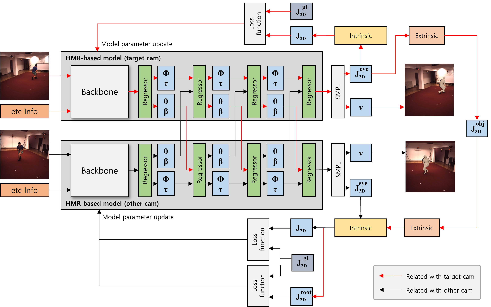

# Multiview based Human Mesh Recovery

## Introduction

This repo is for the paper:
**Multi-view based Human pose and shape estimation**



## Prepare

You have to download pretrained-model files from CLIFF repository(https://github.com/huawei-noah/noah-research/tree/master/CLIFF). After download, move files to CLIFF/data/ckpt directory. <br/>
And, you need to download SMPL models(SMPL_NEUTRAL.pkl) from official site too. Like above, move files to data/smpl.

**[Libraries that have to install before running]**
* ffmpeg 
* libsm6 
* libxext6 
* libxml2-dev 
* libxmlsec1-dev 
* libosmesa6-dev

## Directory
```
${ROOT}
|-- assets
|-- CLIFF
|-- common
|   |-- utils
|   |   |-- cam_utils.py
|   |   |-- conversion.py
|   |   |-- dir_utils.py
|   |   |-- imutils.py
|   |   |-- pose_utils.py
|   |   |-- renderer_pyrd.py
|   |   |-- visutils.py
|-- dataset
|   |-- dataset.py
|   |-- h36m.py
|   |-- multiview_h36m.py
|-- output
|   |-- model_dump
|   |-- result
|   |-- vis
|-- tools
|   |-- extract_joint_regressor.py
|-- eval.py
|-- eval_with_gt2d.py
```

* `CLIFF` contains CLIFF models for applying our method.
* `common` contains utils code.
* `dataset` contains data loading code.
* `output` for saving result, and vis files.
* `tools` contains extra code etc supporting

# Run evaluation code (Fitting process contained)

There are two types that one is for running models without extra datas, second is for running with 2D GT keypoints.

1. running models without extra datas
    ```shell
   # hrnet for original CLIFF (+h36m-p1)
    python3 eval.py --checkpoint CLIFF/data/ckpt/hr48-PA43.0_MJE69.0_MVE81.2_3dpw.pt --version default --backbone hr48 --save-results True --datasets h36m-p1
    # hrnet for MVHMR (+h36m-p1)
    python3 eval.py --checkpoint CLIFF/data/ckpt/hr48-PA43.0_MJE69.0_MVE81.2_3dpw.pt --version mvhmr --backbone hr48 --save-results True --datasets h36m-p1
    ```

2. running with 2D GT keypoints (Fitting)
    ```shell
    # hrnet for original CLIFF (+h36m-p1)
    python3 eval_with_gt2d.py --checkpoint CLIFF/data/ckpt/hr48-PA43.0_MJE69.0_MVE81.2_3dpw.pt --version default --backbone hr48 --save-results True --datasets h36m-p1
    # hrnet for MVHMR (+h36m-p1)
    python3 eval_with_gt2d.py --checkpoint CLIFF/data/ckpt/hr48-PA43.0_MJE69.0_MVE81.2_3dpw.pt --version mvhmr --backbone hr48 --save-results True --datasets h36m-p1
    ```

## Citing
```
@InProceedings{,  
author = {Kwon, Hyeok-Min and Lee, Jun-Ho and Kim, Hwa-Jong},  
title = {},  
booktitle = {},  
year = {2023}  
}  
```

## References

This code is largely refer of below repo.

* https://github.com/nkolot/SPIN.git
* https://github.com/mks0601/I2L-MeshNet_RELEASE.git
* https://github.com/facebookresearch/eft.git
* https://github.com/huawei-noah/noah-research/tree/master/CLIFF